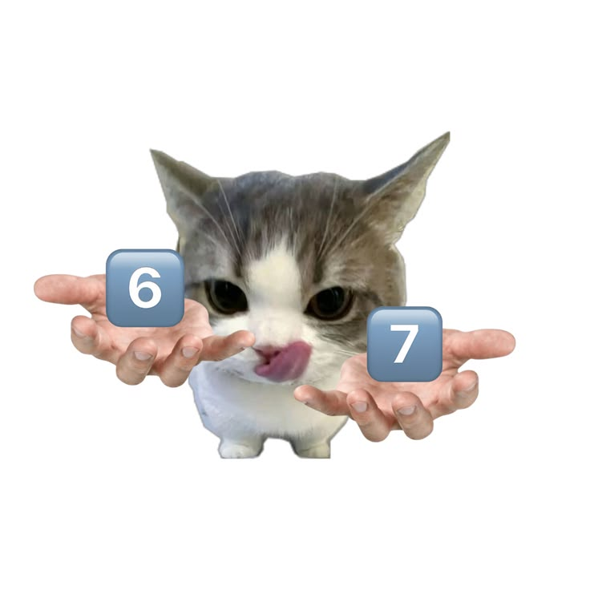

<div align="center">



# 🧠 BRAINROT SHELL
### *The Hand-Written Windows Shell*
#### **[ 67 EDITION ]**

[](https://en.wikipedia.org/wiki/C_(programming_language))
[](https://learn.microsoft.com/en-us/windows/win32/)
[](https://gcc.gnu.org/)


<p align="center">
  <b>Built from scratch in raw C. No ChatGPT vibe-coding, no bloated frameworks.<br>Just pure pointers, manual mallocs, and 67 internet culture.</b>
</p>

</div>

---

```
 ____  ____     _    ___ _   _ ____   ___ _____   ____  _   _ _____ _     _     
| __ )|  _ \   / \  |_ _| \ | |  _ \ / _ \_   _| / ___|| | | | ____| |   | |    
|  _ \| |_) | / _ \  | ||  \| | |_) | | | || |   \___ \| |_| |  _| | |   | |    
| |_) |  _ < / ___ \ | || |\  |  _ <| |_| || |    ___) |  _  | |___| |___| |___ 
|____/|_| \_\_/   \_\___|_| \_|_| \_\\___/ |_|   |____/|_| |_|_____|_____|_____|
                                [ 6 7   E D I T I O N ]
```

---

## ⚡ What is Brainrot Shell?

**Brainrot Shell** is a lightweight command-line shell made from scratch in pure C for Windows. While everyone else was doomscrolling Reels and yelling **"67"**, this was built line-by-line using raw Windows system calls.

No shortcuts, no vibe coding — every argument parser, tokenizer pass, string copy, and heap buffer was manually typed out with real memory management (`malloc` / `free`).

---

## 📜 The "67" Lore

> *"Doot doot... six-seven..."* 🗣️🔥

If you've been on the internet lately, you know the vibe. **67** has zero actual definition, but everyone knows what it means when the palms go up. 

Brainrot Shell channels that exact chaotic energy: why use a boring old terminal when you can navigate your folders with brainrot slang?

---

## 🏛️ How It Works

Everything is kept clean and modular in `src/`:

```
                             $brainrot:/> [your command]
                                          │
                                          ▼
                                ┌───────────────────┐
                                │     baddie.c      │  Splits your input into args
                                │     baddie.h      │  (manual tokenizer)
                                └─────────┬─────────┘
                                          │
                                          ▼
                                     char **args
                                          │
                         ┌────────────────┴────────────────┐
                         │                                 │
                         ▼                                 ▼
               ┌───────────────────┐             ┌───────────────────┐
               │      homie.c      │             │    resolver.c     │
               │      homie.h      │             │    resolver.h     │
               ├───────────────────┤             ├───────────────────┤
               │ Handles built-in  │             │ Finds .exe files  │
               │ commands (gyatt,  │             │ in PATH           │
               │ whereami, ls...)  │             │ (side_chick.c)    │
               └─────────┬─────────┘             └─────────┬─────────┘
                         │                                 │
                         ▼                                 ▼
                  Windows APIs                      CreateProcessA
```

---

## 📂 Project Layout

```
brainrot-shell/
├── assets/
│   └── brainrot_67_logo.png       # The official 67 cat logo
├── bin/                           # Compiled shell binary (gitignored)
│   └── brainrot.exe
├── docs/                          # Notes & architecture diagrams
│   ├── architecture.txt
│   ├── builtins.md
│   ├── cooked.txt
│   └── notes.md
├── src/                           # All source and header files (kept together for v2)
│   ├── baddie.c / baddie.h        # Word counter & argument tokenizer
│   ├── homie.c / homie.h          # Built-in commands
│   ├── resolver.c / resolver.h    # PATH resolver
│   ├── side_chick.c / .h          # Helpers for environment variables & paths
│   └── main.c                     # Main shell loop
├── tests/                         # Playground scripts & tests
│   ├── empty-command.c
│   ├── process_test.c
│   ├── split.py
│   └── testing.c
├── .gitignore                     # Ignores executables & build folders
├── build.bat                      # One-click Windows build script
├── Makefile                       # For make users
└── README.md                      # What you're reading right now
```

---

## 🎮 Commands

Drop the boring legacy terminal commands. Here's what Brainrot Shell understands:

| Command | How to use | Normal shell equivalent | What it does |
|---|---|---|---|
| **`gyatt`** | `gyatt <folder>` | `cd <folder>` | Jump into a subfolder |
| **`gyatt..`** | `gyatt..` | `cd ..` | Go up one folder level |
| **`&gyatt`** | `&gyatt <full_path>` | `cd C:\Users\...` | Jump straight to any absolute path |
| **`whereami`** | `whereami` | `pwd` / `cd` | Tells you where you currently are |
| **`ls`** | `ls` | `dir` / `ls` | Lists files in the current directory |
| **`cooked`** | `cooked` | `help` | Shows the list of built-in commands |
| **`mog`** | `mog` | `cls` / `clear` | Clears the terminal screen |
| **`vibe`** | `vibe` | `ver` | Shows shell version info |
| **`about`** | `about` | `info` | Shows who built this |
| **`skedaddle`** | `skedaddle` or `exit` | `exit` | Peace out and close the shell |

---

## 🛠️ How to Build & Run

### You'll need:
- Windows
- GCC (MinGW, MSYS2, or Git Bash compiler)

### 1. Fastest way (Double-click or run the script):
```cmd
build.bat
```

### 2. Or using `make`:
```cmd
make
make run
```

### 3. Or direct GCC:
```cmd
gcc -Wall -Wextra src/baddie.c src/homie.c src/resolver.c src/side_chick.c src/main.c -o bin/brainrot.exe
```

### Launch it:
```cmd
.\bin\brainrot.exe
```

---

## 🧠 Memory Rule of Thumb

Whenever asking Windows for a dynamic string (like paths or environment variables), the shell follows a simple 4-step rule:

1. **Ask for size:** Query with `NULL` to find out how many bytes Windows needs.
2. **Rent memory:** `malloc()` the exact size from the heap.
3. **Get the data:** Call the function again with the buffer.
4. **Give it back:** Always `free()` the buffer so memory doesn't leak.

---

## 🚀 Coming in v2

- [x] Hand-written argument tokenizer (`baddie.c`)
- [x] Folder navigation built-ins (`gyatt`, `gyatt..`, `&gyatt`)
- [x] File listing (`ls`)
- [x] Memory leak & buffer overflow fixes
- [ ] Running external `.exe` programs from anywhere in PATH
- [ ] Background tasks with trailing `&`
- [ ] Up/Down arrow command history
- [ ] Terminal colors and custom prompt themes

---

<div align="center">

**Hand-written with 💚 and pure 67 energy.**<br>
*Zero vibe-coding. Just real C.*

</div>
